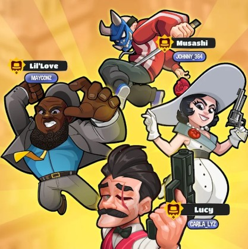

 

  <h1 align="center">
    Hi there 👋 I'm Lupita Macedo 
  </h1>

## About me
- 🎮 Unity developer since 2021  
- 🧠 Focused on gameplay logic, smooth experiences & performance  
- 🐞 Bug fixer & system optimizer  
- 🌱 Always learning something new

## Games I’ve Worked On (and Loved!)
<table>
 <tr>
  
  <td width="50%">
   <h3 align="center">Mafia Kings</h3>
   

     
     
    

     
    

   

  </td>

   <td width="50%">
   <h3 align="center">I'm not Jelly</h3>
   

     
     
    

     
    

   

  </td>

  <td width="50%">
   <h3 align="center">The Lullaby of Life</h3>
   

     
     
    

     
    

   

  </td>

  
 </tr>
 
</table>
<!--
**Blaulux/Blaulux** is a ✨ _special_ ✨ repository because its `README.md` (this file) appears on your GitHub profile.

Here are some ideas to get you started:

- 🔭 I’m currently working on ...
- 🌱 I’m currently learning ...
- 👯 I’m looking to collaborate on ...
- 🤔 I’m looking for help with ...
- 💬 Ask me about ...
- 📫 How to reach me: ...
- 😄 Pronouns: ...
- ⚡ Fun fact: ...
-->
